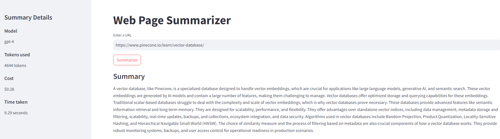
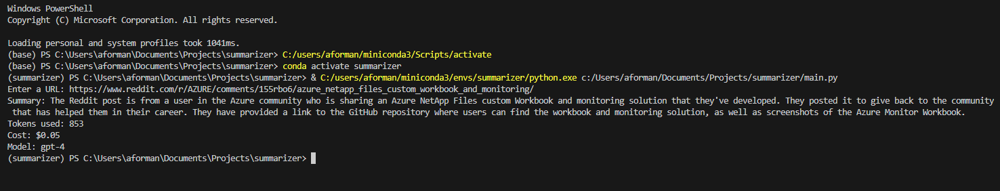

# Web Page Summarizer

This application is a web page summarizer that uses Azure OpenAI's GPT model to summarize the content of a web page. The user inputs a URL, and the application fetches the web page, extracts the text, and uses the GPT model to generate a summary. The application also calculates the cost of the summarization based on the model and the number of tokens used.

# How to Run

1. Create a new conda environment by running `conda create --name myenv python=3.10`.
2. Activate the environment by running `conda activate myenv`.
3. Install the necessary libraries by running `pip install -r requirements.txt`.
4. Set your Azure OpenAI details in the `.env` file.
5. Run `python main.py` to use the application in the command line. You will be prompted to enter a URL, and the application will print the summary, tokens used, cost, and model.
6. Run `streamlit run app.py` to use the application in a web interface. Enter a URL in the text input and click the "Summarize" button to get the summary. The summary, model, tokens used, cost, and time take
n will be displayed.

## Use Cases

This application can be used in a variety of scenarios where quick summarization of web content is needed. Here are a few examples:

- **Research**: If you're doing research on a topic and have a lot of articles to go through, this application can help by providing a quick summary of each article.
- **News Reading**: If you want to stay updated with the latest news but don't have the time to read every article, this application can provide a summary of the news articles.
- **Content Creation**: If you're a content creator and need to gather information on a topic, this application can help by summarizing the content of relevant web pages.
- **Education**: If you're a student and need to do research for a project or an assignment, this application can help by summarizing the content of relevant web pages.

Please note that the quality and accuracy of the summary depend on the GPT model used and the content of the web page.
